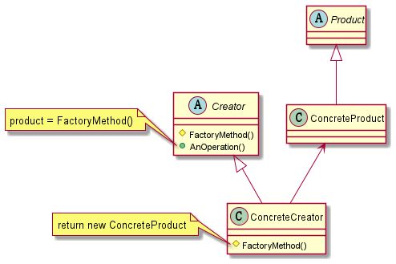

[TOC]

# 意图
定义一个用于创建对象的接口，由子类决定实例化哪一个类。FactoryMethod使一个类的实例化延迟到子类

# 适用性
- 当一个对象不知道它所必须创建对象的类的时候
- 当一个类希望由它的子类来指定实例化对象的时候
- 当类将创建对象的职责委托给帮助子类的中的某一个，并且你希望将哪一个帮助子类是代理者这一信息局部化的时候

# 结构

# 参与者
- `Product`：定义工厂方法所创建对象的接口
- `ConcreteProduct`：实现Product接口
- `Creator`：
  - 声明工厂方法，该方法返回一个Product对象，Creator也可以定义一个工厂方法的缺省实现，它返回一个缺省的Product对象
  - 可以调用工厂方法创建一个Product对象
- `ConcreteCreator`
  - 重定义工厂方法以返回一个`ConcreteProduct`实例

# 协作
`Creator`依赖于它的子类来定义工厂方法，所以它返回一个适当的`ConcreteProduct`实现

# 效果

# 实现

# 别名

# 动机

# 示例代码

# 已知模式

# 相关应用