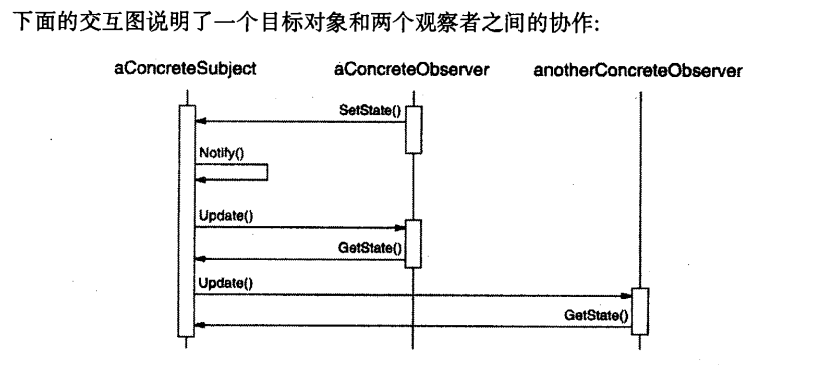

[TOC]

# 意图
定义了对象间一对多的依赖关系，被依赖的对象状态改变时，所有依赖它的对象都将得到通知并自动更新

# 适用性
1. 当一个抽象模型有两个方面，其中一个方面依赖另一个方面，将这两个方面分别封装到独立的对象中，使两者可以各自独立的改变和复用
1. 一个对象改变会影响到其他对象，但这个对象不知道会影响到的对象有那些
1. 一个对象必须通知其他对象，但是它不知道其他对象有哪些，我们希望通知者与被通知者是松耦合的

# 结构
见同目录下的`Observer.puml`文件

# 参与者
- `Subject`
    - 被观察的对象，可以有多个观察者观察一个目标
    - **提供**注册、删除和通知观察者的接口
- `ConcreteSubject`【为什么需要`ConcreteSubject`，因为不同主题的数据状态时是不同的】
    - 将有关状态存入各`ConcreteObserver`对象
    - 当它的状态发生改变时，向它的各个观察者发出通知
- `Observer`
    - 为那些在目标改变后需要获得通知的对象**定义**一个更新接口   
- `ConcreteObserver`
    - 维护一个指向`ConcreteSubject`对象的引用
      - 方便删除
      - 方便使用通知
      - 方便从目标上根据需要获取数据
    - 存储有关状态，这些状态应与目标的状态保持一致（存储的状态就是某个具体观察者需要使用的状态，可能并不需要全部的状态）
    - 实现`Observer`的更新接口以使自身的状态与目标的状态保持一致（这里自身状态指的是被它存储的有关状态）

# 协作
- 当`ConcreteSubject`发生任何导致观察者状态和自身状态不一致的改变时，它会通知它的各个观察者。
- 在得到一个具体目标的改变通知后，`ConcreteObserver`对象可向目标对象查询信息，`ConcreteObserver`使用这些信息以使它的状态和目标对象的状态一致。

用文字描述下交互的过程：
1. `aConcreteObserver`执行`setState`修改状态
2. `aConcreteSubject`修改状态，执行`Notify`方法，`Notify`遍历通知所有观察者【注意：`Notify`并不总是由目标对象调用，它也可以被观察者或其他对象调用】
    - `aConcreteObserver`接收到通知信息【执行`update`】，通过`getState`获取目标状态
    - `anotherConcreteObserver`【泛指其他观察者】接收到通知信息【执行`update`】，通过`getState`获取目标状态

# 效果
主要优点：
1. 独立的改变目标或观察者
1. 可以独立复用目标对象而无需复用其观察者 ，反之亦然
1. 可以在不改变目标和其他观察者的情况下增加新的观察者

其他优缺点：
1. 目标和观察者间的抽象耦合：两者通过抽象进行耦合，耦合度低，所以可以存在一个系统的不同抽象层次中，而不会破坏层次
1. 支持广播通信：目标不需要自己的观察者具体有那些，它只负责通知。我们可以在任何时刻添加和删除观察者，处理还是通知取决于观察者（我觉得应该是取决于客户端）
1. 意外的更新
    1. 观察者不知道其他观察者的存在，所以我们并不能对改变所产生的影响有全面的认识，它对目标的一个看似无害的改变，可能导致其他观察者及其依赖的对象发生更新
    1. ？如果依赖准则的定义或维护不当，常常会引起错误的更新，这种错误很难被捕获
    1. 简单的更新协议并不提供细节表明具体改变了什么，此时如果没有其他协议辅助提供细节，那么为了防止不必要的bug出现，我们只能被迫减少更新

# 实现
1. 创建目标到其观察者之间的映射：目标跟踪需要通知的观察者，简单的方法使显式的在目标中保存对它们的引用。如果目标很多，而观察者较少时，这个方式带来的存储代价会很高。一个解决方案是用时间换空间：使用hash表，代价是访问观察者会相对麻烦一些
1. 观察多个目标：如果一个观察者依赖多个目标，那么此时必须扩展接口使观察者明确目标。
1. 谁触发更新：
    1. 目标：优点是客户端不需要记住调用通知，写法更简单，缺点是多次更新可能会有不必要的中间通知
    1. 观察者：优点是可以自由控制通知时机，减少不必要的通知，缺点是观察者承担了调用的责任，如果忘记调用或异常调用可能会造成bug
1. 对已删除目标的悬挂引用：注意如果删除目标对象，不要在对象里保留悬挂引用
    1. 一个避免悬挂引用的方法是，删除目标后让它通知它的观察者，使其对应的引用复位
    1. 一般来说，不能简单的删除观察者，因为这个观察者可能在观察其他目标，也可能有其他对象依赖这个观察者
1. 目标确认通知前自身状态时一致的【确认通知时是修改后的最新状态】
1. 避免特定于观察者的更新协议——推/拉模型 
    1. 推模型会将其认定的观察者需要的数据通过接口进行传递【也有可能只传递改变的部分】，这种做法的问题是其认定观察者所需要的数据，很多时候都是不足够的，一旦情况有变就需要修改接口，否则就会出错。另外就是通信上的额外开发会大一些，因为数据量有时是相对较大的
    1. 拉模型是只提供最小通知，告知观察者是哪个目标发生改变了，观察者自己对目标进行查询获取相应数据，好处是更稳定，性能更好。缺点是因为没有主动提供改变的部分，观察者需要自己对改变进行判断，写法上会更复杂一些【因为观察者承担了判断改变的职责】
1. 显式的指定感兴趣的改变。为了避免多余而不必要的更新，可以建立"事件"机制，观察者只订阅自己感兴趣的事件，事件触发时，通知其相对应观察者的更新
1. 复杂更新：`ChangeManager`。当目标和观察者之间依赖关系复杂非常时，可以定义一个专门的`ChangeManager`类，用于管理依赖关系。
1. 允许定义一个既有`Observer`也有`Subject`职责的类。有的语言中不允许多重继承，相对于多层级继承，更推荐定义一个同时兼具两种能力的类。

## 关于`ChangeManager`
`ChangeManager`职责：
1. 建立目标和观察者的映射，这样就不需要目标维护观察者的应用，反之亦然
1. 定义特定的更新策略
1. 接收到目标的请求后，负责更新依赖这个目标的观察者

`ChangeManager`可分为两类【分类标准：观察者观察的目标数量】：
1. `SimpleChangeManager`：针对单一目标，每次更新通知其所有的观察者
1. `DAGChangeManager`：针对多目标观察者，用于处理目标和观察者之间依赖关系所构成的无环有向图，观察者有多个目标被改变时，会触发多次更新，`DAGChangeManager`可以保证只有一次更新。如果只有单一目标，那么使用`SimpleChangeManager`会更合适

# 动机

# 别名
- 依赖
- 发布订阅

# 示例代码

# 已知应用

# 相关模式
- `Mediator`
- `Singleton`